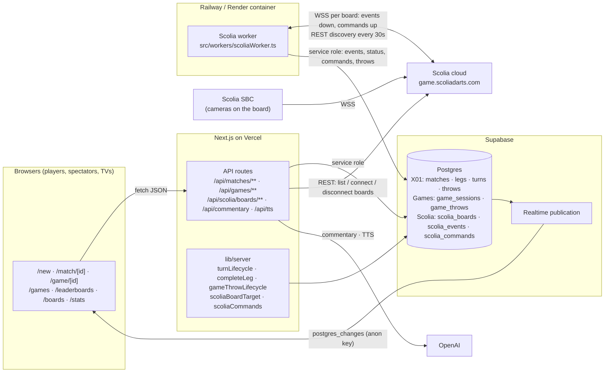
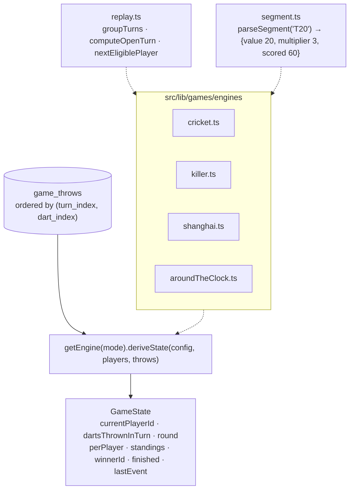
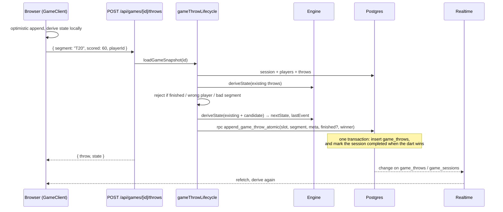
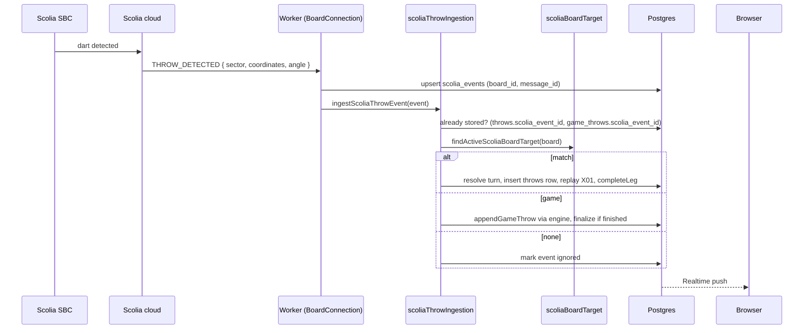
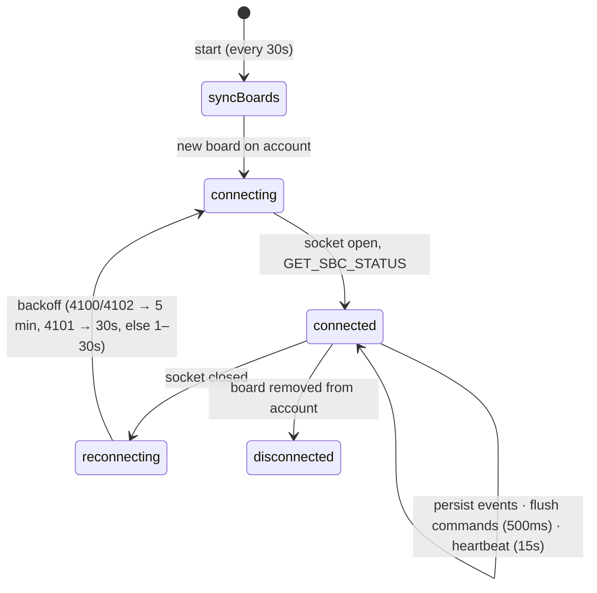
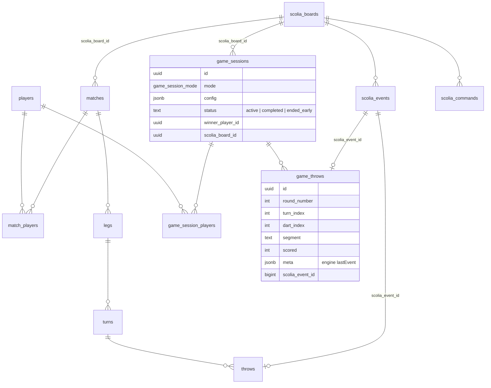

# Dart Highsoft architecture

A Next.js darts scorer on Vercel, a Supabase Postgres backend with Realtime, a long-running Node worker that bridges Scolia camera boards into live games, and OpenAI for optional commentary and speech.

Repo: https://github.com/jameshighcharts/dart-highsoft

## 1. Runtime topology

Browsers never write to Postgres directly. All writes go through the API routes or the worker, both using the service role. Browsers read with the anon key and receive pushed changes over Realtime. The worker is the only component holding Scolia WebSockets, so it runs on a persistent host, not on Vercel.

## 2. Two game families, one board

| | X01 | Party games (Cricket, Killer, Shanghai, Around the Clock) |
|---|---|---|
| Tables | `matches`, `match_players`, `legs`, `turns`, `throws` | `game_sessions`, `game_session_players`, `game_throws` |
| Live page | `/match/[id]` (`MatchClient`) | `/game/[id]` (`GameClient`) |
| Who decides bust / win | Client for manual darts, server for Scolia darts | Server always; client replays the same engine for display |
| State storage | `turns.total_scored`, `turns.busted`, `legs.winner_player_id` | None. State is derived by replaying `game_throws` |
| Rating | Elo (2-player and multiplayer) | None. Per-mode leaderboard views |

A Scolia board drives at most one active match or one active game session. A `before insert` trigger on both tables enforces this across tables and raises `unique_violation`, which the API maps to HTTP 409.

## 3. Party game engine

Rules:

- The throw log is the only stored fact. Undo is "delete the last row and replay".
- Every engine implements `parseConfig`, `finalizeConfig` (Killer assigns numbers here) and `deriveState`.
- `lastEvent` describes what the latest dart did and is written to `game_throws.meta`, so leaderboard views can count marks, kills and Shanghais in plain SQL.
- The Scolia worker imports this code with `node --experimental-strip-types`, so everything under `src/lib/games` and the server helpers it reaches must use relative `.ts` imports, no `@/` alias, no TypeScript `enum`, no `server-only`.

## 4. Life of a manual dart (party game)

The unique key `(session_id, turn_index, dart_index)` makes two devices racing for the same dart safe: the loser gets a 409 and reloads. Since migration 0056 the insert and the session update happen inside one Postgres function (`append_game_throw_atomic`; undo uses `undo_last_game_throw_atomic`, creation uses `create_game_session_atomic` and `create_x01_match_atomic`), so a crash between the two steps cannot leave a won game marked active.

## 5. Life of a Scolia dart

Corrections flow the other way: undoing or editing a Scolia dart in the browser enqueues `DELETE_THROW` or `THROW_CORRECTED` in `scolia_commands`; the worker sends it over the socket and records `ACKNOWLEDGED` or `REFUSED`. Commands are only queued while the dart is still in the board's current physical round (no `TAKEOUT_FINISHED` since).

## 6. Worker lifecycle

## 7. Data model

Views (all `security_invoker = true`): X01 stats and Elo views from earlier migrations, plus `game_mode_leaderboard`, `cricket_leaderboard`, `killer_leaderboard`, `shanghai_leaderboard`, `around_the_clock_leaderboard`.

## 8. Where to look

| Concern | Path |
|---|---|
| X01 rules | `src/utils/x01.ts`, `src/utils/legScoreCalculator.ts`, `src/lib/server/recomputeLegTurns.ts` |
| Party game rules | `src/lib/games/engines/*.ts` |
| Party game server flow | `src/lib/server/gameThrowLifecycle.ts`, `src/lib/server/createGameSession.ts` |
| Scolia protocol | `src/lib/scolia/protocol.ts`, `docs/SCOLIA_SOCIAL_API.md` |
| Scolia ingestion and dispatch | `src/lib/server/scoliaThrowIngestion.ts`, `gameScoliaIngestion.ts`, `scoliaBoardTarget.ts` |
| Worker | `src/workers/scoliaWorker.ts`, `Dockerfile.scolia-worker` |
| Live pages | `src/app/match/[id]/MatchClient.tsx`, `src/app/game/[id]/GameClient.tsx` |
| New game form | `src/app/new/page.tsx`, `src/components/games/NewGameOptions.tsx`, `src/lib/games/labels.ts` |
| Schema | `supabase/migrations/` (0001 base, 0048–0054 Scolia, 0055 party games, 0056 atomic scoring functions) |
