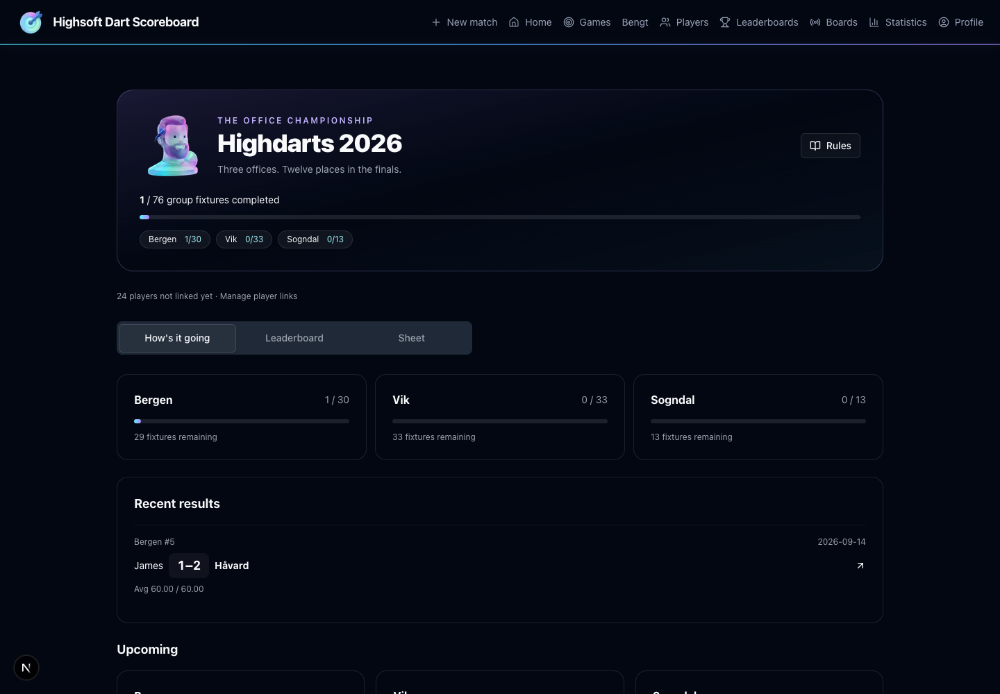
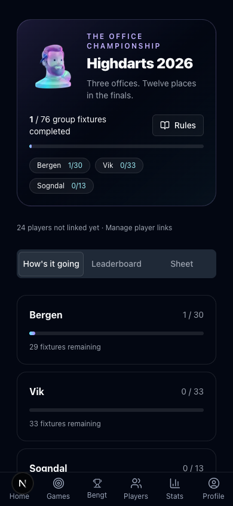
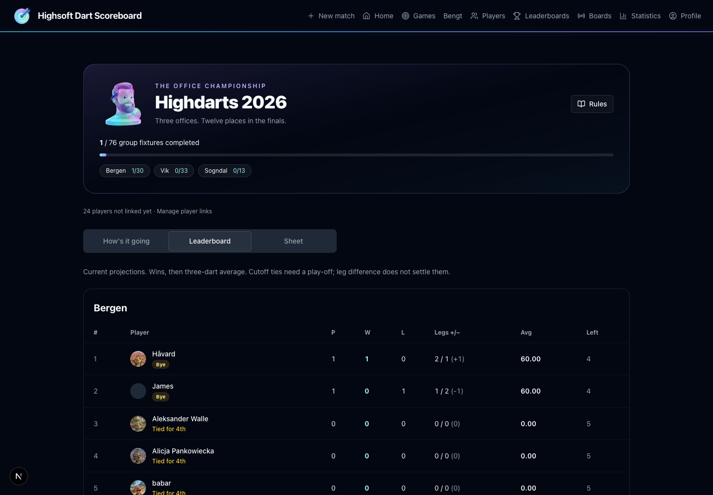
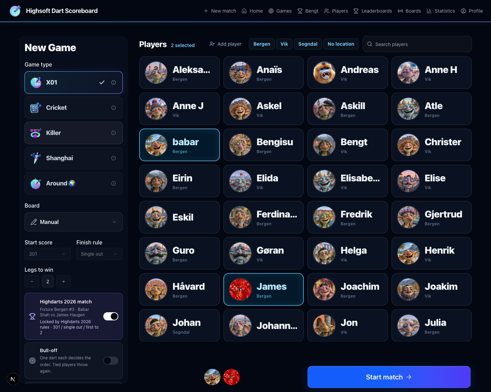

# Highdarts 2026

`/bengt` shows the office tournament, rules, recent results, remaining fixtures and projected finalists. It reads app match data; the Google Sheet is only an authenticated convenience embed. No sheet import runs on the server. Results refresh every 15 seconds while the page is visible and when the window regains focus.

## Deployment

Apply `supabase/migrations/20260914120000_highdarts_2026.sql` before deploying the app. This change has **not** applied that migration to production. The SQL seeds exactly 76 group fixtures: Bergen 30, Vik 33, Sogndal 13. Repeated pairs keep their original fixture numbers. The PDF fixture table, rather than the brief's illustrative repeat-pair sentence, determines the seed.

Run `supabase/tests/highdarts_2026.sql` after migration to verify the schema and RPCs. It uses a transaction and rolls every test write back. It checks fixture count, name folding, permissions, player/settings enforcement, double claims, pre-start conversion, completed and early-ended job creation, rematch isolation, and the consistent snapshot.

## Data and match lifecycle

- `highdarts_events` owns the slug, title and optional Slack channel.
- `highdarts_fixtures` owns the stage, office, fixture number, original sheet names and optional app player links. Its match link and `matches.highdarts_fixture_id` are unique and must agree at commit.
- `create_highdarts_match_atomic` uses the existing match creation and optional bull-off RPCs, then validates and links the fixture in the same transaction. Invalid players/settings and a competing claim roll everything back, including the created match.
- `link_highdarts_match_atomic` locks the match and fixture before checking for scoring darts. It converts an unstarted friendly to 301/single out/first to 2, with fair ending off. The scoring insert trigger takes the same match lock, so tagging and the first dart are serialized.
- Tagged group settings and lineups are protected in the database. The existing player APIs and UI also reject lineup changes. Standalone permanent deletion is blocked for tagged matches to preserve fixture history.
- The pre-start prompt appears after a bull-off has completed, before scoring darts. Spectators never see it. A friendly decision is stored per match in localStorage. A raced first dart produces a 409 response and directs the scorer to start a new match from Bengt.
- Rematches deliberately use ordinary match creation and do not inherit fixture IDs. Repeated drawn pairs must select their remaining numbered fixture explicitly through the tournament flow.
- A database completion trigger enqueues `highdarts_result` in `background_jobs`. This covers manual scoring, fair-ending completion helpers, hardware scoring and early endings without a Slack request in the scorer response.
- Early endings consume the fixture claim but do not award standings points. They appear as ended early, rather than a win. An organiser must review any required replay; the app does not silently release an unfinished fixture or rewrite published results.

Both new tables have public SELECT policies and server-only writes. All Highdarts RPCs except the pure name normalizer are service-role only. The snapshot is `security invoker`, and no new views bypass RLS. Its one-statement JSON aggregation avoids PostgREST's 1,000-row cap on turn history. Browser responses do not include Slack delivery markers.

## Link players

The migration matches an active player's full display name or nickname exactly after case/diacritic normalization. It does not guess that a first name belongs to a full sheet name. An ambiguous or missing name remains unlinked, and matching both sides to the same player leaves one side unresolved rather than failing the seed.

In `/admin`, an admin sees a Highdarts player-links panel. Choose the correct app player for a sheet name and press Save. One save calls `map_highdarts_player_atomic` to update every unstarted fixture with that exact sheet name in the same event and office. The API requires `requireAdmin`; active-player and distinct-opponent checks also run in the transaction. Claimed fixtures cannot be remapped there.

A read-only dry run against 73 active app players on 2026-09-14 resolved Guro and Gjertrud. These 28 names still require a human mapping:

| Bergen | Vik | Sogndal |
| --- | --- | --- |
| Aleksander Walle | Andreas Tistel | Johan Flo |
| Alicja Pankowiecka | Anne Hauge | Jon Skjerdal |
| Babar Shah | Askele Johansson | Jorgen Tistel |
| Ferdinand Berntsen | Bengt Abelsen Ohlen | Mykhailo Pelykh |
| Havard Gundersen | Elida Espeland | Sindre Jensen |
| James Haugen | Elise Fosse | |
| Ken-Havard Lieng | Helga Brudevoll | |
| Kseniia Hadzhun | Joakim Rudolfsen | |
| Nicolas Silvester | Linda Sven | |
| Nikita Myklebust | Pawel Kubica | |
| Stian Totland | Sigrid Lundeland | |
| | Silje Tverberg | |

Office standings follow the fixture's office, even if a player's app location has changed. The dry run did not change live player links.

## Standings and ties

Only completed tagged group matches with a winner and without `ended_early` count. Rows sort by wins, then the unrounded three-dart average, then leg difference and name for stable display. Fourth-place ties compare wins and average; leg difference never awards a place across that cutoff. Everyone in an unresolved cutoff tie is marked undecided.

Each office winner projects to a bye. The highest-average second-place finisher across offices projects to the fourth bye. Equal best averages require a playoff regardless of differing office win totals, because this cross-office decision is explicitly based on average. All qualifications remain projections until the office stage and any tie matches are settled. The app flags ties but does not resolve them or generate a bracket.

Averages reuse `calculate3DartAverage`: points divided by actual scoring darts, multiplied by three. Bust visits and fair-ending tiebreak turns are excluded, matching existing match-stat behavior. Bull-off darts live separately and never enter the average. The older global `player_summary.avg_per_turn` leaderboard uses average visit totals, so it can differ on one- or two-dart visits. This feature does not change that global metric or claim the two calculations are identical.

## Slack setup and delivery

Configure `SLACK_BOT_TOKEN` with `chat:write`, invite the bot to the results channel, and set `SLACK_HIGHDARTS_CHANNEL_ID` to that channel's ID. `highdarts_events.slack_channel_id`, when set, overrides the environment value. `NEXT_PUBLIC_APP_URL` supplies links to the match report and Bengt page. Existing Supabase background-job dispatch and Vault configuration must be active as described in `SLACK_DARTS.md`.

Missing channel or bot token skips delivery with a `console.info`. There is no automatic backfill when configuration is later added. To backfill an undelivered result, an organiser can requeue its existing `highdarts_result` background job after checking the fixture has no posted message.

The handler builds a plain-text fallback and Block Kit result with player mentions when links exist, legs, averages, highest recorded checkout, and report/standings buttons. Early endings are explicitly excluded from the table.

A conditional `NULL` → `sending` update claims delivery before contacting Slack. After success, the timestamp replaces `sending`; retries skip timestamps already recorded. If the network result is uncertain, `sending` is retained and retries fail without posting again. This chooses duplicate prevention over automatic retries that could post a second result. To recover, check the Slack channel: if the message exists, record its actual timestamp; otherwise clear the marker and requeue the failed job. Never clear it without checking. The app cannot atomically commit a database transaction and Slack's remote HTTP side effect.

## Finals later

The schema accepts `playoff`, `quarterfinal`, `semifinal`, `final` and `tiebreak` stages with a nullable office. Fixture numbers are unique within event/stage/office, including finals with a null office. Add fixtures through server-side administration or a reviewed migration. The current creation/linking RPCs intentionally accept only group fixtures. Add stage-specific validation and progression before enabling finals starts: playoff 301/single out, quarterfinal and semifinal 301/double out, final 501/double out, all first to two legs. Bracket generation, pairing, and tie resolution are outside this change.

## Verification and screenshots

The migration was applied from scratch to disposable PostgreSQL 18 using the repository's core schema and current X01/bull-off creation functions. Unrelated DartIQ evidence capture was stubbed in that isolated harness. Rollback tests passed. Two concurrent fixture claims produced exactly one match and one conflict with no orphan match. The real Next.js creation API also persisted the expected format, pair and reciprocal link against the local bridge. This is not a claim that a full Supabase environment or production deployment was exercised.

Final checks: 1,417 tests passed, lint had no errors, and `npm run build -- --webpack` passed. The webpack flag is required in this worktree because Turbopack rejects its shared `node_modules` symlink.

Desktop and mobile checks used the real Next.js app, a loopback-only HTTP bridge to that disposable database, and clearly synthetic local results. Slack was disabled. Verified dashboard refresh, tab order, rules, fixture deep links, two-player preselection, disabled 301/single-out/first-to-two settings, and no horizontal overflow on the setup page. No real Slack result was sent. The embedded sheet still requires the viewer's Highsoft Google session.

