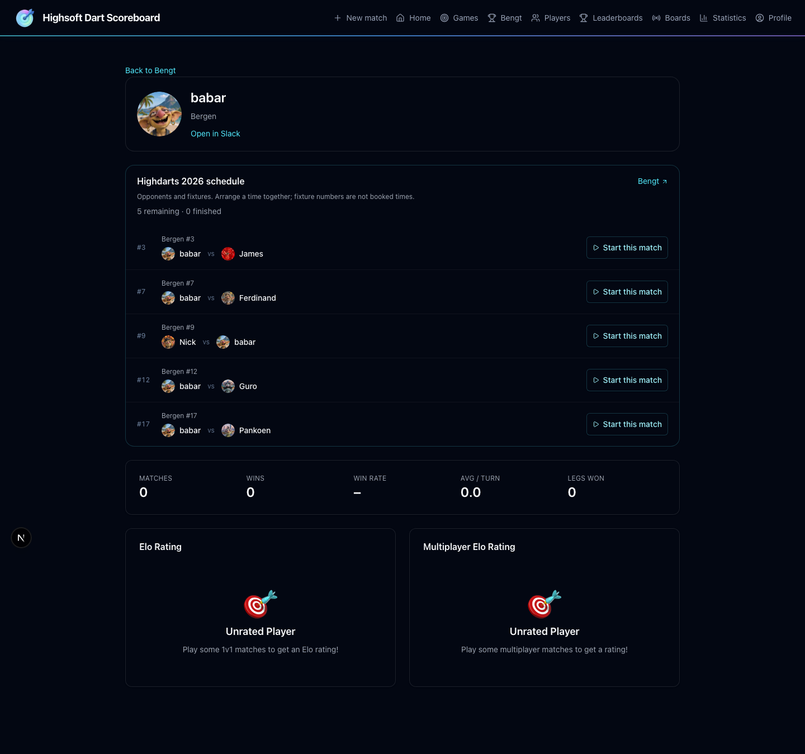
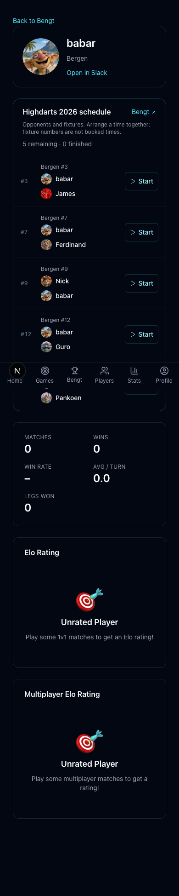
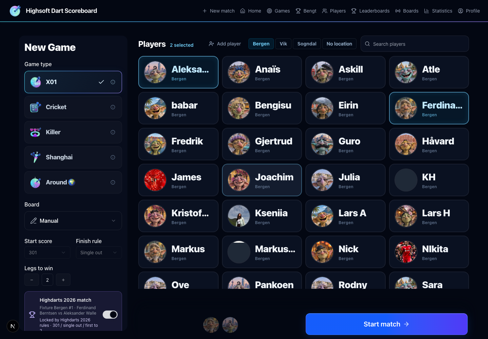

# Highdarts 2026

`/bengt` shows the office tournament, rules, recent results, remaining fixtures and projected finalists. It reads app match data; the embedded Google Sheet mirrors the app through a one-way five-minute Apps Script sync. No sheet import runs on the server. App results refresh every 15 seconds while the page is visible and when the window regains focus.

## Deployment

Apply `supabase/migrations/20260914120000_highdarts_2026.sql`, followed by `supabase/migrations/20260914163000_highdarts_finals.sql`, before deploying the app. This change has **not** applied that migration to production. The SQL seeds exactly 76 group fixtures: Bergen 30, Vik 33, Sogndal 13. Repeated pairs keep their original fixture numbers. The PDF fixture table, rather than the brief's illustrative repeat-pair sentence, determines the seed.

Run `supabase/tests/highdarts_2026.sql` after migration to verify the schema and RPCs. It uses a transaction and rolls every test write back. It checks fixture count, name folding, permissions, player/settings enforcement, double claims, pre-start conversion, completed and early-ended job creation, rematch isolation, and the consistent snapshot.

## Data and match lifecycle

- `highdarts_events` owns the slug, title and optional Slack channel.
- `highdarts_fixtures` owns the stage, office, fixture number, original sheet names and optional app player links. Its match link and `matches.highdarts_fixture_id` are unique and must agree at commit.
- `create_highdarts_match_atomic` uses the existing match creation and optional bull-off RPCs, then validates and links the fixture in the same transaction. Invalid players/settings and a competing claim roll everything back, including the created match.
- `link_highdarts_match_atomic` locks the match and fixture before checking for scoring darts. It converts an unstarted friendly to 301/single out/first to 2, with fair ending off. The scoring insert trigger takes the same match lock, so tagging and the first dart are serialized.
- Tagged group settings and lineups are protected in the database. The existing player APIs and UI also reject lineup changes. Standalone permanent deletion is blocked for tagged matches to preserve fixture history.
- The pre-start prompt appears after a bull-off has completed, before scoring darts. Spectators never see it. A friendly decision is stored per match in localStorage. A raced first dart produces a 409 response and directs the scorer to start a new match from Bengt.
- Rematches deliberately use ordinary match creation and do not inherit fixture IDs. Repeated drawn pairs must select their remaining numbered fixture explicitly through the tournament flow.
- A database completion trigger enqueues `highdarts_result` in `background_jobs`. This covers manual scoring, fair-ending completion helpers, hardware scoring and early endings without a Slack request in the scorer response.
- Early endings consume the fixture claim but do not award standings points. They appear as ended early, rather than a win. An organiser must review any required replay; the app does not silently release an unfinished fixture or rewrite published results.

Both new tables have public SELECT policies and server-only writes. All Highdarts RPCs except the pure name normalizer are service-role only. The snapshot is `security invoker`, and no new views bypass RLS. Its one-statement JSON aggregation avoids PostgREST's 1,000-row cap on turn history. Browser responses do not include Slack delivery markers.

## Link players

The migration matches an active player's full display name or nickname exactly after case/diacritic normalization. It does not guess that a first name belongs to a full sheet name. An ambiguous or missing name remains unlinked, and matching both sides to the same player leaves one side unresolved rather than failing the seed.

In `/admin`, an admin sees a Highdarts player-links panel. Choose the correct app player for a sheet name and press Save. One save calls `map_highdarts_player_atomic` to update every unstarted fixture with that exact sheet name in the same event and office. The API requires `requireAdmin`; active-player and distinct-opponent checks also run in the transaction. Claimed fixtures cannot be remapped there.

A read-only dry run against 73 active app players on 2026-09-14 resolved Guro and Gjertrud. These 28 names still require a human mapping:

| Bergen | Vik | Sogndal |
| --- | --- | --- |
| Aleksander Walle | Andreas Tistel | Johan Flo |
| Alicja Pankowiecka | Anne Hauge | Jon Skjerdal |
| Babar Shah | Askele Johansson | Jorgen Tistel |
| Ferdinand Berntsen | Bengt Abelsen Ohlen | Mykhailo Pelykh |
| Havard Gundersen | Elida Espeland | Sindre Jensen |
| James Haugen | Elise Fosse | |
| Ken-Havard Lieng | Helga Brudevoll | |
| Kseniia Hadzhun | Joakim Rudolfsen | |
| Nicolas Silvester | Linda Sven | |
| Nikita Myklebust | Pawel Kubica | |
| Stian Totland | Sigrid Lundeland | |
| | Silje Tverberg | |

Office standings follow the fixture's office, even if a player's app location has changed. The dry run did not change live player links.

## Standings and ties

Only completed tagged group matches with a winner and without `ended_early` count. Rows sort by wins, then the unrounded three-dart average, then leg difference and name for stable display. Fourth-place ties compare wins and average; leg difference never awards a place across that cutoff. Everyone in an unresolved cutoff tie is marked undecided.

Each office winner projects to a bye. The highest-average second-place finisher across offices projects to the fourth bye. Equal best averages require a playoff regardless of differing office win totals, because this cross-office decision is explicitly based on average. All qualifications remain projections until the office stage and any tie matches are settled. Admins resolve qualification ties through separate tie-break fixtures before locking the finals bracket.

Averages reuse `calculate3DartAverage`: points divided by actual scoring darts, multiplied by three. Bust visits and fair-ending tiebreak turns are excluded, matching existing match-stat behavior. Bull-off darts live separately and never enter the average. The older global `player_summary.avg_per_turn` leaderboard uses average visit totals, so it can differ on one- or two-dart visits. This feature does not change that global metric or claim the two calculations are identical.

## Slack setup and delivery

Configure `SLACK_BOT_TOKEN` with `chat:write`, invite the bot to the results channel, and set `SLACK_HIGHDARTS_CHANNEL_ID` to that channel's ID. `highdarts_events.slack_channel_id`, when set, overrides the environment value. `NEXT_PUBLIC_APP_URL` supplies links to the match report and Bengt page. Existing Supabase background-job dispatch and Vault configuration must be active as described in `SLACK_DARTS.md`.

Missing channel or bot token skips delivery with a `console.info`. There is no automatic backfill when configuration is later added. To backfill an undelivered result, an organiser can requeue its existing `highdarts_result` background job after checking the fixture has no posted message.

The handler builds a plain-text fallback and Block Kit result with player mentions when links exist, legs, averages, highest recorded checkout, and report/standings buttons. Early endings are explicitly excluded from the table.

A conditional `NULL` → `sending` update claims delivery before contacting Slack. After success, the timestamp replaces `sending`; retries skip timestamps already recorded. If the network result is uncertain, `sending` is retained and retries fail without posting again. This chooses duplicate prevention over automatic retries that could post a second result. To recover, check the Slack channel: if the message exists, record its actual timestamp; otherwise clear the marker and requeue the failed job. Never clear it without checking. The app cannot atomically commit a database transaction and Slack's remote HTTP side effect.

## Finals draw

The Sluttspill tab has four rounds. Play-offs use 301 straight out; quarterfinals and semifinals use 301 double out; the final uses 501 double out. Every match is first to two legs, with fair ending off. The new-match page and pre-start tagging use the fixture's stage to select and enforce these settings. Fair ending remains visible beside Highdarts and can be enabled for regular single-leg matches.

`projectFinals` takes group standings and enumerates the legal cross-office play-off pairs: two 2nd-vs-4th pairs, one 3rd-vs-4th pair, and one 3rd-vs-3rd pair. It evaluates quarterfinal assignments, minimizing possible same-office quarterfinal meetings first and semifinal meetings second. Two byes from the same office must be in opposite halves. Deterministic ordering makes repeated projections stable. Untouched or unresolved places show TBD.

After every group fixture finishes and qualification ties are resolved, an admin can edit the twelve seeded positions, then use Lock the draw. The server independently rebuilds standings, validates all players and pairing constraints, and calls a transaction that compares the exact snapshot before writing eleven fixtures. `next_fixture_id` and `next_slot` route winners. Concurrent updates reject a stale draw. Source results and fixtures are protected while the draw is locked. Unlock is available before any finals scoring; it removes the draw and any claimed, unplayed finals matches. Once a finals dart exists, unlocking is rejected.

A completed finals match advances its winner in the same database transaction, including hardware scoring. A repeated completion is harmless. A winner already advanced to another round cannot be overwritten. Early endings do not advance a player.

Tie-break controls appear in Tabell and under the bracket. Admins can create a current fourth-place or best-second tie-break after the relevant group games finish. The tie's standings fingerprint prevents stale tie-break results deciding changed standings. With more than two tied players, the organiser selects the next pair from the remaining contenders; losers are eliminated until the required number of places remains. Tie-break scoring never changes group averages or win counts.

## Dashboard

Tabs are ordered How's it going, Tabell, Sluttspill, Sheet. Group completion is the headline number, with a Today count for all completed tournament games in the Europe/Oslo calendar day. The progress bar separates group games completed before today from those completed today. Counts scan every fixture, not just the ten recent results.

The three office progress cards select a searchable, six-row upcoming list. Linked personal fixtures appear first. Tabell shows three tables side by side on desktop and stacked on mobile, using avatars, first names, W, L, AVG and Left. Full names remain in title text. Every player has one status pill. The Rules control sits next to Highdarts 2026. The Sheet iframe applies `invert(0.9) hue-rotate(180deg)` as requested; this also changes embedded image and chart colours.

## Verification and screenshots

The migration was applied from scratch to disposable PostgreSQL 18 using the repository's core schema and current X01/bull-off creation functions. Unrelated DartIQ evidence capture was stubbed in that isolated harness. Both rollback SQL suites passed, including all eleven finals games, next-slot advancement, format rejection, stale snapshots, unlock before scoring, rejection after the first dart, and locked source protection. Two concurrent fixture claims produced exactly one match and one conflict with no orphan match. The real Next.js creation API also persisted the expected format, pair and reciprocal link against the local bridge. This is not a claim that a full Supabase environment or production deployment was exercised.

Final checks: 1,440 tests passed, lint had no errors, and `npm run build -- --webpack` passed. The webpack flag is required in this worktree because Turbopack rejects its shared `node_modules` symlink.

Desktop and mobile checks used the real Next.js app, a loopback-only HTTP bridge to that disposable database, with zero completed games. The earlier synthetic James–Håvard result and all three test claims were removed. SQL regression writes roll back. Slack was disabled. Verified dashboard refresh, tab order, rules, fixture deep links, two-player preselection, disabled 301/single-out/first-to-two settings, and no horizontal overflow on the setup page. No real Slack result was sent. The embedded sheet still requires the viewer's Highsoft Google session.

### Native browser E2E

`e2e/highdarts.spec.ts`, with `playwright.highdarts.config.ts`, exercises Chromium on desktop and mobile through Next.js → PostgREST 16.3 → PostgreSQL 18. It is opt-in (`HIGHDARTS_E2E_NATIVE=1`) and hardwired to the disposable `highdarts_e2e` database on local port 56555, REST proxy on 56558, and app on 3017. Its reset deletes synthetic game data only in that dedicated database. The separate user preview on 3016 is untouched.

The complete workflow passed on 2026-09-14 in 26.2 seconds, with no uncaught browser errors. It checks all four tabs, Rules, upcoming search and pagination, personal fixtures, compact standings, mobile overflow, the iframe filter, fair-ending visibility, fixture setup, browser scoring and undo after reload, result averages and report navigation. It races two real match-creation requests, verifies a standalone rematch does not count as a tournament fixture, seeds the remaining group history, resolves a qualification tie through the admin UI and scoring API, edits and locks/unlocks the draw, and scores all eleven finals matches through the real throw, turn and leg APIs. It checks stage formats, automatic winner advancement, duplicate protection, unlock rejection after scoring, all bracket report links, 88 queued result jobs, and anonymous RPC denial.

The local environment uses development authentication, empty board data and a stub for DartIQ evidence capture. It does **not** exercise real OAuth, Supabase Realtime, Scolia hardware, Slack delivery, Google sign-in inside the iframe, or a production migration. The standard Docker-based Supabase E2E environment was unavailable on this machine; this run uses native PostgreSQL and the official PostgREST binary instead.

To repeat in the prepared local environment:

```sh
HIGHDARTS_E2E_NATIVE=1 node --env-file=/private/tmp/highdarts-e2e-app/.env.local node_modules/@playwright/test/cli.js test -c playwright.highdarts.config.ts
```

The isolated app and database must already be running; the config does not provision them. The local HTML report is `/private/tmp/highdarts-e2e-report/index.html`. A clean checkout without this environment skips the native test.

The browser run exposed an obsolete match-load failure overwriting a newer successful snapshot. `useMatchData` now discards errors from superseded requests, with regression coverage for both stale failures and valid current-request failures.


## Player profiles and board reservations

`/profile` includes the signed-in member's linked tournament schedule. Names in upcoming fixtures, results, standings, qualification lists and finals link to `/players/[playerId]`. That read-only profile shows the player's schedule, stats and saved Slack identity for the viewer's workspace. It never guesses a Slack identity from a name or modifies a player link. The identity migration maps the 30 sheet participants through reviewed Highsoft Slack user IDs, including aliases such as KH, Pankoen and Nick. It fills missing IDs on unclaimed group fixtures without replacing existing assignments or changing any player profile. Future unmapped entries remain unlinked until an organiser maps them in Admin. Fixture numbers express the draw, not booked dates or times.

Names use first names across Bengt. Repeated first names across the complete draw get the last-name initial, including when the app player has only a first name and the mapped fixture retains the surname. Full app names remain available on hover.

Fixture setup selects its office filter and configured Scolia board, alongside the existing two-player lineup and enforced round settings. Board location follows the existing board picker convention: board names contain Bergen, Vik or Sogndal. A configured office board must be used; a busy or offline board cannot silently fall back to manual scoring. Offices without a configured Scolia board can use manual scoring. Finals without an office retain explicit board selection.

Deploy `20260914190000_highdarts_board_availability.sql` and `20260914191500_highdarts_player_identities.sql` before the app update. Its claim guard serializes tournament starts using the existing event lock and board advisory lock. It rejects a second active tournament match in the same office, overlapping tournament players, a busy office board, and manual/wrong-office board bypasses. Paused, unfinished games retain their reservation. The same guard applies when tagging an unstarted friendly. Existing board constraints still arbitrate normal X01 and party-game starts. A failed claim rolls back the entire match creation.

Verification additions:

- `supabase/tests/highdarts_board_availability.sql` is a rollback-only regression for busy offices, independent offices, board selection, busy friendlies and orphan prevention.
- `scripts/highdarts-profile.integration.mjs` is opt-in with `HIGHDARTS_PROFILE_NATIVE=1`. It requires the prepared disposable `bengt_profile` database on PostgreSQL port 56555 and the local app on 3020. It first tests identity backfill, repeat idempotence and existing-assignment preservation inside a rolled-back transaction. It then creates isolated synthetic fixtures, races real API requests, verifies one success and one conflict, rejects a duplicate retry, and removes its own records.
- Desktop/mobile checks exercised Bengt → match setup and My profile → opponent profile, including correct player selection, locked Highdarts rules and no horizontal overflow. Local preview uses a read-only copy of the existing player IDs, avatars and Slack links, with zero completed games and development authentication. All 76 fixtures resolve to existing players. `AUTH_DEV_SLACK_USER_ID` optionally selects the local preview identity when the existing development-only bypass is enabled; it does not enable that bypass in production. Actual Scolia hardware, OAuth and Slack client opening were not exercised.

Final follow-up validation: 1,450 tests passed, lint reported zero errors (23 existing warnings), and the webpack production build passed. The native identity/API harness and rollback board suite passed. Refreshed desktop/mobile screenshots use existing player avatars and IDs; no production records were written.





## Google Sheet sync

The published rev.3 workbook is [Highdarts_2026 rev.3](https://docs.google.com/spreadsheets/d/1gIbV9OM3RsItTwQQPgwQjAxwOfPsfaPLRA08RXqsp_c/edit). The Bengt iframe uses its published URL. Its bound [Apps Script project](https://script.google.com/home/projects/1EcrAbJqHvGcZ21GMfV4MghaI1l-vO1qSavdf1ym67Sj1RDoNG4JdPKYx/edit) runs `scripts/highdarts-sheet/Code.gs`.

`GET /api/highdarts/sheet` exports only the data displayed in that public workbook. This exact read-only path is public so the script can fetch it without storing app sessions or privileged database credentials. It excludes player IDs, avatars, Slack identities, boards, match IDs and raw throws. Other tournament API paths retain their existing authentication. The feed reuses `buildStandings` and `resultStats`; the sheet does not recalculate qualification or averages independently. Stored per-player counting choices are exported as Tel for A/B.

The sync owns Kampoppsett C:H and J:K on rows 3–32, 34–46 and 48–80; Tabell A:E on rows 5–16, 21–25 and 30–42; and Sluttspilltre B6:B9, B13:D16, B20:D23, B27:D28 and B32:D32. It updates each tab's A1 explanation and Sluttspilltre B2 after success. Winner/points formulas, notes, other helper cells and all formatting remain in place. Standings values replace the visible table formulas to preserve the app's dart-weighted averages, ranking and tie-break behavior. Finals show the locked draw and confirmed winners; an unlocked draw clears its old entries.

Run `installHighdartsSync` once in the bound script to refresh and create one five-minute trigger owned by the installing Google account. Repeated installation does not duplicate the trigger. `@OnlyCurrentDoc` limits spreadsheet authorization to this workbook. A Highdarts menu also provides manual refresh. The script verifies all 76 office/fixture-number pairs, table sizes and the entire response before editing any cells. A fetch failure or invalid response leaves existing values intact. An execution error is visible in Apps Script Executions. The published iframe may lag the editable sheet by several minutes.

Validate with `npm run test:run -- src/lib/highdarts/sheetExport.test.ts scripts/highdarts-sheet/Code.test.mjs src/proxy.test.ts`; the Apps Script tests execute the actual `.gs` source in Node. After installation, run a manual refresh and compare the API projection to all owned sheet ranges, then confirm a scheduled execution succeeds.
