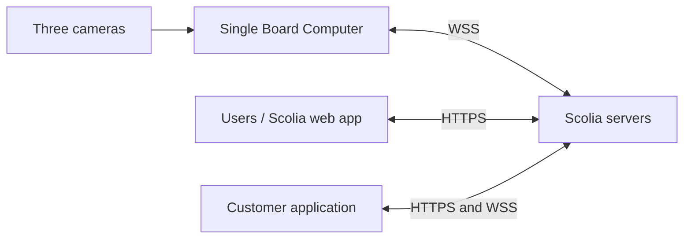
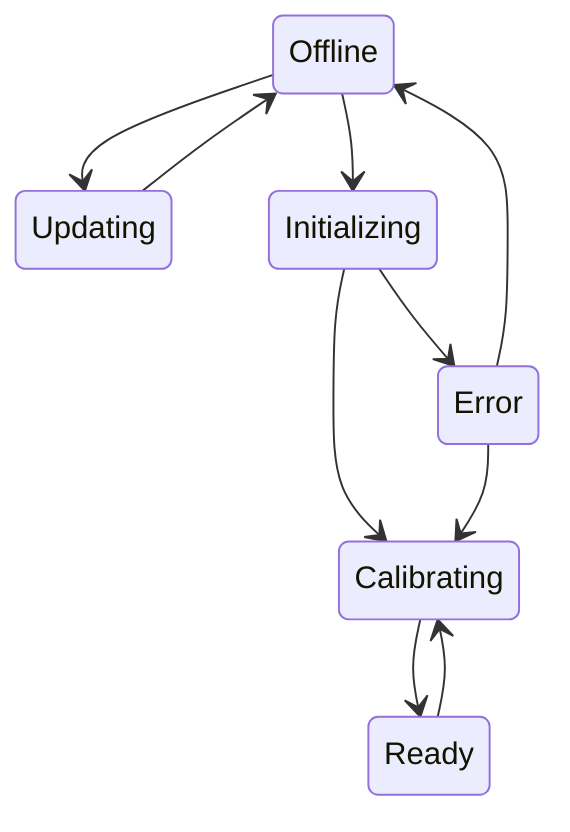

# Scolia Social API v1.2

Technical documentation converted from `Scolia API - Documentation.pdf`.

## 1. Architecture overview

Scolia consists of two main parts. The first is the Single Board Computer (SBC), which handles the hardware, including the cameras, and performs image processing locally. It forwards every detected event to the Scolia servers through a live WebSocket connection.

The Scolia servers handle network communication between the system components and other cloud services. They also include the databases and games available to users through the public Scolia domain.

A customer application can use a purchased SBC through Scolia's servers over WebSocket connections.



## 2. Authentication process for the SBC

### 2.1 Authentication overview

Scolia Social uses a unified authentication process based on the board serial number and an access token for third-party applications. Without these credentials, a customer application cannot reach or control purchased boards directly.

### 2.2 Authenticating

The third-party application must authenticate while communicating with the Scolia Social servers. Authentication uses the board serial number and the supplied access token.

For the WebSocket API, provide both values as URL query parameters.

## 3. General information

### 3.1 SBC status and phase

An SBC has two distinct properties:

- **Status** describes the operational state of the SBC.
- **Phase** describes a condition that affects which game events can be detected.

If the SBC is not in the `Ready` status, its phase is `null`.

#### Status conditions

- **Offline:** The SBC is offline or cannot establish a connection to the Scolia servers.
- **Updating:** The SBC received a firmware file from the server.
- **Initializing:** The SBC is initializing. No messages are sent to it, and no throws are detected or forwarded. This is the first status entered during startup.
- **Calibrating:** The SBC is calibrating its cameras. No messages are sent to it, and no throws are detected or forwarded. This status follows `Initializing`.
- **Ready:** The SBC is ready to detect throws and takeout events and forward the corresponding messages. After startup, the SBC normally reaches `Ready` in about 50-60 seconds.
- **Error:** An error prevents normal SBC operation. Throws are not detected or forwarded until the status becomes `Ready`.

The intended startup and recovery transitions are illustrated below. Error types include camera and calibration errors.



#### Phase conditions

- **Throw:** The SBC detects throws and forwards them to the servers.
- **Takeout:** The SBC has detected the start of dart removal and is waiting for it to finish. The SBC cannot detect throws during this phase.

### 3.2 WebSocket error codes

Scolia Social may use these codes when closing a connection:

| Code | Meaning |
| --- | --- |
| `4000` | A pong response did not arrive within the required time. |
| `4100` | The connection URL contains an invalid serial number. |
| `4101` | Another WebSocket connection is already established for this board serial number. |
| `4102` | The supplied access token is invalid. |

## 4. WebSocket API

### 4.1 Connecting

An application can establish one secure WebSocket connection per purchased SBC. Append the board serial number as `serialNumber` and the access token as `accessToken`.

```js
const ws = new WebSocket(
  'wss://game.scoliadarts.com/api/v1/social?serialNumber=SERIAL_NUMBER&accessToken=ACCESS_TOKEN'
);
```

Opening a second connection for the same serial number causes that connection to close immediately with code `4101`.

Every channel message follows a strict JSON structure and has two required root properties:

- `type`: the operation or event name as an uppercase string with underscore separators.
- `id`: a UUID version 4 identifier according to RFC 4122. Outgoing messages require an ID, and incoming messages include one. IDs correlate requests with `ACKNOWLEDGED` and `REFUSED` responses and assist debugging.

The optional `payload` object contains message-specific content.

```json
{
  "type": "MESSAGE_TYPE",
  "id": "UUID",
  "payload": {
    "property": "value"
  }
}
```

### 4.2 Outgoing messages

The following table shows the SBC statuses in which an application can send each state-dependent message. A cross means the server responds with `REFUSED`.

| Message | Offline | Initializing | Calibrating | Ready | Error |
| --- | :---: | :---: | :---: | :---: | :---: |
| `GET_SBC_STATUS` | Yes | Yes | Yes | Yes | Yes |
| `GET_CAMERA_IMAGES` | No | No | Yes | Yes | Yes |
| `RECALIBRATE` | No | No | No | Yes | Yes |
| `RESET_PHASE` | No | No | No | Yes | No |
| `THROW_CORRECTED` | No | No | No | Yes | No |
| `DELETE_THROW` | No | No | No | Yes | No |

#### 4.2.1 `GET_SBC_STATUS`

Requests the board's current status and phase.

Responses:

- `SBC_STATUS` when valid.
- `REFUSED` when the message has an invalid ID.

```json
{
  "type": "GET_SBC_STATUS",
  "id": "UUID"
}
```

#### 4.2.2 `GET_CAMERA_IMAGES`

Requests current images from the three attached cameras. Images are returned as Base64-encoded JPEG strings according to RFC 4648.

Responses:

- `CAMERA_IMAGES` when valid.
- `REFUSED` when the ID is invalid or the SBC is `Offline` or `Initializing`.

The response is normally around 100 KB. Requests are limited to one every three seconds.

```json
{
  "type": "GET_CAMERA_IMAGES",
  "id": "UUID"
}
```

#### 4.2.3 `RECALIBRATE`

Requests SBC calibration. During calibration, board status is `Calibrating`. After calibration, the status changes to `Ready` or `Error`. The application receives `SBC_STATUS_CHANGED` messages for these changes.

Responses:

- `ACKNOWLEDGED` when valid.
- `REFUSED` when the ID is invalid or the SBC is `Offline`, `Initializing`, or `Calibrating`.

```json
{
  "type": "RECALIBRATE",
  "id": "UUID"
}
```

#### 4.2.4 `RESET_PHASE`

Requests that the SBC reset its internal phase to `Throw` and remove all throws from the current round. This is typically used when takeout did not finish normally.

Responses:

- `ACKNOWLEDGED` when valid.
- `REFUSED` when the ID is invalid or the SBC is not `Ready`.

```json
{
  "type": "RESET_PHASE",
  "id": "UUID"
}
```

#### 4.2.5 `THROW_CORRECTED`

Notifies the SBC that a user corrected a throw in the application. `throwIndex` must be `0`, `1`, or `2`, representing the throw's zero-based sequence number in the round.

Responses:

- `ACKNOWLEDGED` when valid.
- `REFUSED` when the payload or ID is invalid or the SBC is not `Ready`.

```json
{
  "type": "THROW_CORRECTED",
  "id": "UUID",
  "payload": {
    "throwIndex": 0
  }
}
```

#### 4.2.6 `DELETE_THROW`

Notifies the SBC that the application deleted a throw from the current round. This keeps the SBC phase synchronized with the real board state. `throwIndex` must be `0`, `1`, or `2`, representing the throw's zero-based position in the round.

Responses:

- `ACKNOWLEDGED` when valid.
- `REFUSED` when the payload or ID is invalid or the SBC is not `Ready`.

```json
{
  "type": "DELETE_THROW",
  "id": "UUID",
  "payload": {
    "throwIndex": 0
  }
}
```

#### 4.2.7 `CONFIGURE_SBC`

Configures behavior for the SBC associated with the current WebSocket connection. It can be sent regardless of SBC status.

Responses:

- `ACKNOWLEDGED` when valid.
- `REFUSED` when the payload or ID is invalid.

Properties:

- `enableMessageForwardToScolia`: boolean, `true` by default. When disabled, messages are delivered only to the customer server and are not handled by the Scolia application.

```json
{
  "type": "CONFIGURE_SBC",
  "id": "UUID",
  "payload": {
    "enableMessageForwardToScolia": true
  }
}
```

#### 4.2.8 `GET_SBC_CONFIGURATION`

Requests the current SBC configuration.

Responses:

- `SBC_CONFIGURATION` when valid.
- `REFUSED` when invalid.

```json
{
  "type": "GET_SBC_CONFIGURATION",
  "id": "UUID"
}
```

### 4.3 Incoming messages

These messages are sent from the Scolia Social server to the customer application through the WebSocket channel.

#### 4.3.1 `HELLO_CLIENT`

Sent after an authenticated WebSocket connection opens successfully. It contains the current board status and phase and may include the detailed error type (`Camera` or `Calibrate`) when status is `Error`.

```json
{
  "type": "HELLO_CLIENT",
  "id": "UUID",
  "payload": {
    "boardStatus": "Ready",
    "boardPhase": "Throw",
    "errorType": null
  }
}
```

#### 4.3.2 `SBC_STATUS`

Contains the current SBC status and phase and may include a detailed error type. This is the response to `GET_SBC_STATUS`.

```json
{
  "type": "SBC_STATUS",
  "id": "UUID",
  "payload": {
    "boardStatus": "Error",
    "boardPhase": null,
    "errorType": "Camera"
  }
}
```

#### 4.3.3 `SBC_STATUS_CHANGED`

Sent when SBC status changes. A phase-only change does not trigger this message.

```json
{
  "type": "SBC_STATUS_CHANGED",
  "id": "UUID",
  "payload": {
    "boardStatus": "Calibrating",
    "boardPhase": null,
    "errorType": null
  }
}
```

#### 4.3.4 `THROW_DETECTED`

Contains all detected-throw information, including the sector, coordinates, angle, suggestions, and detection time.

The `sector` string includes the multiplier, when applicable, and the score:

- Lowercase `s` is the single area between the treble ring and the 25/Bull area.
- Uppercase `S` is the single area between the double ring and the treble ring.
- `D` is double.
- `T` is treble.
- `25` is the outer bull.
- `Bull` is the inner bull.
- `None` means no scoring sector.

Allowed values:

```text
(["S" | "s" | "D" | "T"] + [1-20]) | "25" | "Bull" | "None"
```

Regular expression from the source documentation:

```regex
/(([SsDT]{1})(20|1[0-9]|[1-9]))|25|Bull|None/
```

Properties:

- `sector`: detected sector using the values above.
- `coordinates`: two numbers. The first is horizontal and the second is vertical, each in the interval `-250` to `+250` millimeters.
- `angle`: horizontal and vertical dart angles. Interpretable values are between `-90` and `+90` degrees.
- `bounceout`: indicates that the dart landed outside the dartboard, either by bouncing out or landing on the surround.
- `sectorSuggestions`: zero to three nearby sector names that can assist score correction after an erroneous detection.
- `detectionTime`: UTC detection time as a simplified extended ISO 8601 string.

```json
{
  "type": "THROW_DETECTED",
  "id": "UUID",
  "payload": {
    "sector": "S1",
    "coordinates": [40, 138],
    "angle": {
      "vertical": 82.1234,
      "horizontal": 89.0012
    },
    "bounceout": false,
    "sectorSuggestions": ["S20", "T20", "T1"],
    "detectionTime": "2019-10-05T14:48:14.000Z"
  }
}
```

#### 4.3.5 `TAKEOUT_STARTED`

Triggered when a user enters the cameras' field of view during dart takeout.

```json
{
  "type": "TAKEOUT_STARTED",
  "id": "UUID",
  "payload": {
    "time": "2019-10-05T14:48:14.000Z"
  }
}
```

#### 4.3.6 `TAKEOUT_FINISHED`

Triggered when takeout finishes and the cameras' field of view is clear again. After this message, the SBC is ready to detect upcoming throws.

`falseTakeout` means the user entered the cameras' field of view but did not remove the darts from the board.

```json
{
  "type": "TAKEOUT_FINISHED",
  "id": "UUID",
  "payload": {
    "falseTakeout": false,
    "time": "2019-10-05T14:48:14.000Z"
  }
}
```

#### 4.3.7 `CAMERA_IMAGES`

Contains three Base64-encoded JPEG camera images according to RFC 4648. This is the response to `GET_CAMERA_IMAGES`.

The payload is normally around 100 KB. Requests are limited to one every three seconds.

```json
{
  "type": "CAMERA_IMAGES",
  "id": "UUID",
  "payload": {
    "images": [
      "data:image/jpeg;base64,/9j/4RILRXh[...]fqxQ//9k=",
      "data:image/jpeg;base64,/9j/4RILRXh[...]fqxQ//9k=",
      "data:image/jpeg;base64,/9j/4RILRXh[...]fqxQ//9k="
    ]
  }
}
```

#### 4.3.8 `ACKNOWLEDGED`

Indicates that a previous message was accepted but has no specific response type, such as `RESET_PHASE`. `replyTo` contains the acknowledged message ID.

```json
{
  "type": "ACKNOWLEDGED",
  "id": "UUID",
  "payload": {
    "replyTo": "UUID"
  }
}
```

#### 4.3.9 `REFUSED`

Indicates that a previous message was rejected because of validation failure or a conflict with the current SBC state. For example, `THROW_CORRECTED` cannot be sent while the SBC is not `Ready`.

The payload contains a specific machine-readable error, a human-readable message, and the refused message ID.

```json
{
  "type": "REFUSED",
  "id": "UUID",
  "payload": {
    "replyTo": "UUID",
    "error": "ErrorMessage",
    "errorMessage": "Human readable error message."
  }
}
```

#### 4.3.10 `SBC_CONFIGURATION`

Contains the current SBC configuration. This is the response to `GET_SBC_CONFIGURATION`.

```json
{
  "type": "SBC_CONFIGURATION",
  "id": "UUID",
  "payload": {
    "enableMessageForwardToScolia": true
  }
}
```

## 5. REST API

### 5.1 Authentication

The REST API uses HTTP Bearer authentication. The bearer token can be provided through:

- The `Authorization` header in the form `Bearer TOKEN`.
- The `access_token` body parameter.
- The `access_token` query parameter.

### 5.2 API endpoints

#### 5.2.1 Get all boards connected to the account

```http
GET https://game.scoliadarts.com/api/social/boards
```

Responses:

- `200`: array of connected boards.

```json
[
  {
    "name": "board name",
    "serialNumber": "serial number",
    "isHomeSbc": false
  }
]
```

#### 5.2.2 Connect a board to the account

```http
PUT https://game.scoliadarts.com/api/social/boards
```

Payload:

```json
{
  "serialNumber": "SERIAL_NUMBER"
}
```

Responses:

- `200`: board connected.

```json
{
  "name": "board name",
  "serialNumber": "serial number",
  "isHomeSbc": false
}
```

- `409`: board has already been connected.

```json
{
  "error": "Board has already been connected."
}
```

- `404`: invalid serial number.

```json
{
  "error": "Invalid serial number: SERIAL_NUMBER"
}
```

#### 5.2.3 Disconnect a board from the account

```http
DELETE https://game.scoliadarts.com/api/social/boards/SERIAL_NUM
```

Responses:

- `200`: board deleted.
- `404`: invalid serial number.

```json
{
  "error": "Board is not connected to this service account."
}
```
